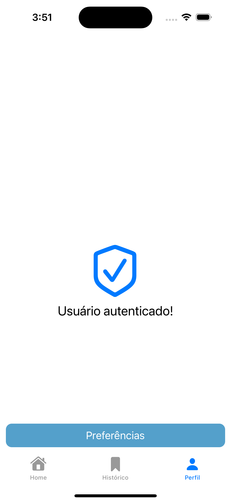

# Dario - Aplicativo Solidário

Projeto desenvolvido para defesa do TCC em Engenharia da Computação na UTFPR - Universidade Tecnológica Federal do Paraná.  
Desenvolvido em Swift - UIKit, MVVM e sem bibliotecas tercerias.  
Sua integração com o projeto DarioAPI integra o aplicativo a um backend que processa as requisições do aplicativo, utilizando um algoritmo de similaridade por métodos cosseno é capaz de devolver ao aplicativo uma lista de eventos solidários contextuais as preferências do usuário.  

 
## Snapshots

  
 

 
  

  
 

 
  

 
  

 
  

 
  

 
  

 
  

 
  

 
  
